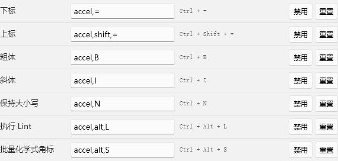

# Linter for Zotero — Zotero DIY 维护版

用于校验、整理和补全文献元数据的 Zotero 插件。基于 [Northword/Linter for Zotero](https://github.com/northword/zotero-format-metadata) 维护，当前版本 **4.1.0**。安装清单声明兼容 Zotero **10.0–10.999**；已在 Windows 的 Zotero **10.0.3** 中完成真实运行测试。

本目录包含完整源码、参考数据、测试、审查记录和可安装的 XPI。上游版权和 AGPL-3.0 许可证保留；上游项目介绍见 [原始 README](docs/UPSTREAM-README.md)。

## 安装

下载 [Linter for Zotero 4.1.0 安装包](dist/linter-for-zotero.xpi)，在 Zotero 的插件管理器中选择「从文件安装插件」，再选择该 XPI。安装包的更新地址指向本项目的 `dist/update.json`。

本维护版保留上游插件 ID，因此安装会替换同 ID 的上游 Linter。建议先在测试资料库检查自己的规则设置，再对正式资料库执行批量整理。

## 功能与操作

- 41 项标准规则：标题、化学式上下标、作者、语言、日期、卷期页、DOI、期刊／会议缩写、学校所在地及 ESI 分类等。
- 7 项手动工具：标题书名号、作者扩展、指定语言、更新元数据、短 DOI、CSL Extra 和清理 Extra。手动工具不参与自动整理。
- 标题设置增加「自动格式化化学式上下标」，默认关闭；可通过菜单或 `Ctrl+Alt+S` 对选中条目执行，macOS 使用 `Cmd+Alt+S`。
- 快捷键可录制、禁用和恢复默认，重复组合与无效输入会提示；设置使用紧凑布局，支持窄窗口换行。
- 数据先校验、再处理，统一事务保存并提供批次撤销；取消组合工具会停止后续规则，超时后阻止通过规则接口继续写入。
- 无匹配结果时保留人工缩写；非 ESI 系列默认保留。外部元数据服务支持回退，空值不覆盖已有字段。

建议按「核对类型与 DOI → 补充元数据 → 少量条目整理 → 核对报告 → 分类批量整理」操作。详细配置、数据格式与处理顺序见 [元数据整理流程](docs/metadata-workflow-zh.md)，功能审查及限制见 [逻辑审查记录](docs/logic-audit-2026-09-29.md)。



## 开发与复现

需要 Node.js 22+、pnpm 12.3.4；真实 E2E 还需要 Zotero 和 PowerShell 7（Windows）。在本目录执行：

```powershell
pnpm install --frozen-lockfile
pnpm test:unit
pnpm lint:check
pnpm build
pnpm exec tsc --noEmit --project test/tsconfig.json
$env:ZOTERO_PLUGIN_ZOTERO_BIN_PATH='C:\Program Files\Zotero\zotero.exe'
$env:LINTER_TEST_LOCALE='zh-CN' # 或 en-US
pnpm test:e2e
```

E2E 脚本先构建生产 XPI，再启动独立测试资料库，并实际安装该生产包验证打包数据。Windows 下默认不执行框架的全局 Zotero 结束命令，配合 `-no-remote` 保留已打开的个人实例。测试不会安装到个人资料库。

普通开发的 `pnpm start` 仍使用框架的默认启动流程；运行前请配置 `.env.example` 中的程序与独立配置目录。请勿将私人 `.env` 或资料库提交到仓库。

## 参考数据

内置数据包括 26,700 条期刊缩写、117 条会议缩写、1,410 条学校所在地和 311 条物理学 ESI 记录。可配置自定义 JSON／CSV；数据结构不正确时会提示并回退到内置数据。ESI 表来自本目录的 `物理学ESI.xlsx`，不代表覆盖所有学科或最新名单。

期刊数据来源保留为 Git 子模块。克隆集合仓库时使用 `git clone --recurse-submodules`，或在仓库根目录执行 `git submodule update --init --recursive`。`pnpm update-data` 使用 Bash、Python 和相应数据生成依赖；更新 ESI 工作簿需要 `openpyxl`。普通构建使用已生成的数据，不需要重新生成或安装 Python。

真实 PDF 回归使用提交的三页合成文档；`test/data/generate-pages-fixture.py` 仅在重新生成该文档时需要 `reportlab`。

## 验证范围

已通过 179 项单元测试、中文与英文各 29 项真实 Zotero E2E、全量 ESLint／AutoCorrect、生产构建及两套 TypeScript 检查。真实 E2E 覆盖数据库事务失败与重试、撤销／重做、菜单和快捷键、窗口生命周期、自定义 CSV／JSON、PDF 索引页数及生产 XPI 安装。成品散列与环境见 [验证记录](dist/verification.json)。

外部 API 和网页转换器使用受控响应验证；实时网站连通性、限流和数据质量尚未验收。Semantic Scholar 作者姓名尚未映射到 Zotero 作者字段。未实机验收 macOS、Linux 或其他插件的全部组合，也未覆盖所有复杂／加密 PDF；其他边界见审查记录。

## 来源与许可证

上游作者 Northword 及原贡献者；维护基础提交为 `2b747409e8c3df866fca327a8ad859d770694a5b`。本维护版由 groele 在 Zotero DIY 中整理，保留 [AGPL-3.0 许可证](LICENSE)。本项目为社区维护项目。
