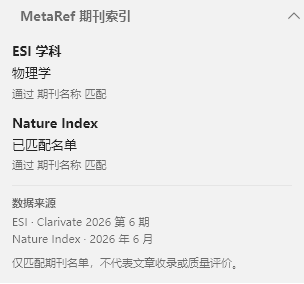

# MetaRef for Zotero — 文献元数据助手


用于校验、整理和补全文献元数据的 Zotero 插件，当前版本 **11.0.4**，支持 Zotero **10.0–10.999**。项目仓库：[Zotero-diy / Linter-for-Zotero](https://github.com/groele/Zotero-diy/tree/main/Linter-for-Zotero)。基于 [Northword/Linter for Zotero](https://github.com/northword/zotero-format-metadata) 开发，保留上游版权及 AGPL-3.0 许可证。

## 安装

下载 [MetaRef 11.0.4 安装包](dist/metaref-for-zotero.xpi)，在 Zotero 插件管理器中选择「从文件安装插件」。MetaRef 使用独立插件 ID `metaref@groele`、资源命名空间 `metaref`、实例 `Zotero.MetaRef` 和设置前缀 `extensions.zotero.metaref`。

安装前移除已有 Linter／旧 MetaRef 插件，避免两个实例同时整理条目。此版本从默认设置开始，不迁移旧设置；需要重新选择自定义数据库及配置快捷键。

## 功能

- 40 项标准规则与 9 项手动工具，处理标题、化学式角标、作者、语言、日期、卷期页、DOI、缩写、所在地和 Extra。手动工具不参与自动整理。
- MetaRef 内部 22 项菜单直接显示，以分隔线区分操作顺序；没有嵌套子菜单。
- 独立的期刊索引侧栏及 ESI、Nature Index 列，不写入文献字段或标签。菜单查询打开结果窗口，关闭后可以再次执行。
- 侧栏分别显示匹配结果及命中依据，只保留一组数据来源和简短解释。标题区没有附加图标或按钮；数据库更新在设置页操作。
- ESI 与 Nature Index 可分别使用自定义 JSON／CSV，支持校验、重新读取、恢复内置名单及导出内置 JSON。异常文件回退到内置数据并显示原因。
- 快捷键支持录制、禁用、重置与冲突检查；默认上标组合为 Ctrl+Shift+=，macOS 使用 Cmd。
- 批处理采用有界并发和统一保存，支持取消、事务失败恢复、撤销／重做及规则错误隔离。

详细操作见 [元数据整理流程](docs/metadata-workflow-zh.md)，数据库格式见 [自定义数据库指南](docs/custom-journal-databases.md)。



## 数据文件

内置 ESI 数据覆盖 Clarivate 2026 年第 6 期全部 22 个学科、12,245 条记录；Nature Index 使用 2026 年 6 月名单，含 177 种期刊和 1 个会议记录，期刊文章只匹配期刊记录。

[完整 JSON／CSV 及模板](dist/databases/README.md) · [数据库压缩包](dist/metaref-journal-databases.zip)

数据库来源见 [ESI](data/esi/README.md) 和 [Nature Index](data/nature-index/README.md)。名单匹配不表示某篇文章收录或质量评级。此次没有在线更新数据库快照。

## 开发和验证

需要 Node.js 22+、pnpm 12.3.4，Windows 真实 E2E 使用 Zotero 与 PowerShell 7。

```powershell
pnpm install --frozen-lockfile
pnpm test:unit
pnpm lint:check
pnpm build
pnpm exec tsc --noEmit --project test/tsconfig.json
$env:ZOTERO_PLUGIN_ZOTERO_BIN_PATH='C:\Program Files\Zotero\zotero.exe'
$env:ZOTERO_PLUGIN_PROFILE_PATH=Join-Path $PWD '.scaffold/test/profile'
$env:METAREF_TEST_LOCALE='zh-CN' # 或 en-US
pnpm test:e2e
```

E2E 在独立资料库打开原生菜单、侧栏和设置窗口，并安装生产 XPI 检查打包数据，不替换个人资料库中的插件。当前验收记录见 [verification.json](dist/verification.json) 和 [本轮审查](docs/current-review.md)。外部服务使用受控响应验证；不据此宣称实时网络服务可用。

普通开发的 `pnpm start` 需先配置 `.env.example` 中的程序和独立资料库目录。数据生成见 `pnpm update-data`，普通构建直接读取已生成的数据。上游项目说明保留在 [UPSTREAM-README](docs/UPSTREAM-README.md)。
