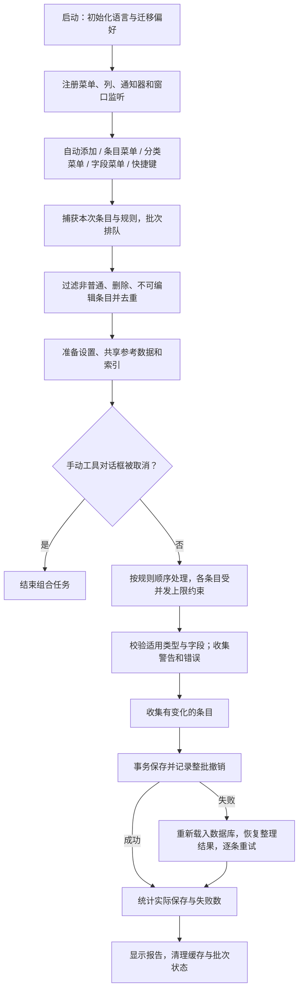

# Linter for Zotero 逻辑链路审查与整合记录

审查日期：2026-09-29。范围包括启动及关闭、偏好迁移、菜单、快捷键、标题编辑、48 项注册规则与工具、参考数据、外部元数据服务、批处理保存及结果报告。

当前注册内容为 41 项标准规则与 7 项手动工具。所有工具均归类为 `tool`，不参与自动整理。功能名称以注册代码为准；功能文档中的旧名称、计划功能与实际功能已进行对齐。

## 统一的数据处理流程

标准规则按注册顺序执行；调用者指定的组合任务按其传入顺序执行，例如先更新元数据、再标准整理。批次串行，批内条目并发为 1–16；非法并发值回退到 1。建议日常保持默认并发 1，尤其是使用外部服务时。

## 已修复的主要逻辑问题

| 环节 | 原问题 | 整合后的行为 |
| --- | --- | --- |
| 偏好迁移 | 旧键的删除目标错误；假值可能被默认值替换；并发修复触发重载 | 保留 `false`、`0` 和空串；删除旧键；保护已迁移的新值；批次读取并发配置 |
| 批次事务 | 前面的 `save()` 清除内存变更标记，事务回滚后逐条重试可能漏保存 | 保存整理结果快照，回滚后重新载入并恢复所有待保存条目，再逐条重试 |
| 规则超时 | 异步规则超时后仍可能修改条目或向下个批次写入报告 | 规则持有的条目接口在结束、失败或超时后失效；超时后的报告被忽略 |
| 保存边界 | Extra 字段工具内部自行保存、部分写入未等待 | 统一等待字段操作，规则不自行落盘，批处理负责事务和撤销 |
| 取消 | 设置工具取消后，后续规则仍可能执行 | 工具返回取消时停止整个组合任务；确认后才执行工具 |
| 插件关闭 | 等待批处理时，批处理又等待未关闭的设置对话框 | 先关闭对话框和通知器，再等待处理结束，最后清理界面 |
| 分类菜单 | Zotero 10 提供分类行，原入口依赖条目数组 | 从实际选中的分类行取得条目，再交给统一批处理 |
| 菜单与自定义列 | 注册与注销使用的 ID 不一致，多窗口重复注册 | 保存运行时返回的 ID，准确注销；全局入口仅注册一次 |
| 标题编辑 | 焦点与编辑控件替换导致预览遗漏或残留 | 监听窗口焦点、编辑焦点及控件替换；按当前标题编辑框刷新和关闭 |
| 标题预览 | 直接渲染元数据中的任意 HTML | 仅创建允许的富文本节点，移除事件属性，其他文本转义显示 |
| 参考数据 | 同批并发读取和重建索引；失败缓存妨碍重试 | 共享读取及派生索引的 Promise；失败可重试；批次结束清理 |
| 自定义数据 | 格式异常时缺乏明确回退 | 校验 JSON/CSV 结构，报告原因并使用内置数据 |
| 缩写 | 找不到匹配项时可能清空人工缩写 | 未找到替代值时保留原值 |
| ESI | 菜单入口缺失；带斜杠或逗号的学科名被错误拆分；覆盖人工系列 | 补全菜单；先识别完整学科名；非 ESI 系列默认保留，可显式允许覆盖 |
| 作者扩展 | 重复附加信息、切换国家信息失败、备份被污染 | 保留原作者备份，从原姓名生成注释，一次提交作者列表 |
| CSL 工具 | 操作共享的 Zotero Schema 映射 | 复制映射后修改工具自身数据 |
| 元数据转换 | 转换阶段异常无法回退；空值或坏字段覆盖已有数据 | 每个服务的请求和转换共同隔离；校验数据后应用；空值保留原字段 |
| 标识符 | PMID 与 PMCID 混用；arXiv URL、版本号及 DOI 前缀处理不完整 | 按标识符类型构建请求，规范化 DOI 和 arXiv ID，保护已有 DOI |
| 页码 | 空串、小数或科学计数法可能被当作起始页 | 只接受 1–3 位正整数及有效 PDF 总页数 |
| 统计 | 保存失败仍可能被视为成功 | 区分已处理、失败、保存、取消；保存错误单独进入报告 |

## 功能模块核对

| 模块 | 检查内容与验证方式 |
| --- | --- |
| 启动、关闭、窗口生命周期 | 迁移顺序；重复窗口初始化不增加菜单、列或监听；实际等待工具关闭后完成插件关闭，再重新初始化 |
| 条目及分类入口 | 实际分类包含的条目可整理，分类外的条目保持原值；同批重复条目及规则仅处理一次 |
| 标题与短标题 | 尾点、标点、句式大小写、化学式、短标题执行顺序；已有富文本及大小写保护；条目类型字段映射 |
| 快捷键与工具栏 | 真实标题选区编辑；重复按键、组合冲突、无效输入、禁用及重置；检索框和其他字段不触发标题操作 |
| 作者、语言、日期、卷期页 | 多种条目类型本地规则；作者缺失报告；拼音及数字转换单元测试；页码保守适用条件 |
| 期刊、会议、学校及 ESI | 内置索引匹配；真实带 BOM 的 JSON 和含引号／逗号的 CSV 读取、失败回退；人工缩写与系列保留；包含分隔符的学科解析 |
| 七项工具 | 标题书名号、作者扩展、指定语言、元数据更新、短 DOI、CSL Extra、清理 Extra；实际规则执行及六个设置对话框的取消，清理 Extra 的实际确认 |
| 外部服务 | DOI 长短转换、CrossRef 查 DOI、arXiv DOI 提取、Semantic Scholar 的 PMID 请求与回退、Zotero 搜索及网页转换器；响应在真实 Zotero 中受控替换并恢复 |
| 批处理与数据库 | 实际数据库落盘；注入事务失败和永久保存失败；并发上限；排队选择快照；取消及后续批次；正常批次撤销、重做 |
| 报告与通知器 | 异常字符串与常规异常隔离；晚到报告屏蔽；导入延迟后再次检查开关；使用可见文本渲染报告 |
| 包装 | 构建类型与语言声明；实际安装生产 XPI 并读取包内期刊／ESI 数据；检查版本与兼容范围 |

本地综合回归在期刊文章、会议论文、学位论文、图书、专利、网页、预印本上执行 39 项本地标准规则。另行验证 2 项网络标准规则和 7 项工具的执行路径。这不表示每个规则的所有可能数据分支均已穷尽。

## 参考数据与处理原则

| 打包数据 | 当前记录数 | 用途 |
| --- | ---: | --- |
| `journal-abbr.json` | 26,700 | 期刊全称与缩写索引 |
| `conference-abbr.json` | 117 | 会议缩写索引 |
| `university-place.json` | 1,410 | 学校所在地匹配 |
| `esi-journals.json` | 311 | 当前内置物理学 ESI 期刊匹配 |

参考文件没有为本次修复手工改写。条目数据先校验类型和目标字段，再生成变更，最后统一保存。匹配无结果与服务无返回不能作为清空人工数据的理由。

ESI 内置表只覆盖当前打包的物理学记录，不能据此宣称覆盖所有学科或最新 ESI 名单。自定义 CSV 需要包含可识别的期刊名称或 ISSN，以及学科分类；自定义缩写 JSON 为名称到缩写的字符串映射。数据更新继续使用现有更新流程。

## 操作与界面

1. 新建或导入后，先核对文献类型、DOI 和来源。
2. 需要补充来源数据时使用「更新元数据」；通常选择补空字段，确认需要覆盖时再使用覆盖模式。
3. 按少量选中条目执行标准 Lint，核查结果报告及作者、日期、期刊、卷期页。
4. 化学式可通过标题设置的自动选项、右键菜单或 `Ctrl+Alt+S` 执行。自动选项默认关闭；含义不明确的缩写需人工核对。
5. 确认规则配置适合当前资料库后，再使用添加条目自动整理或分类批量整理。

快捷键设置将功能、录制框、组合键预览及操作排列在紧凑网格中。「禁用／重置」保持成组。已在中英文真实设置页以 570、470、350 像素宽度检查换行、按钮可达与横向溢出。中文宽布局的七项设置约 272 像素高；窄布局采用分行排布。

## 验证结果及边界

最终命令结果和成品散列记录于 `../dist/verification.json`。179 项单元测试、21 个测试文件通过；Zotero 10.0.3 中中文与英文各 29 项 E2E 通过。全量 ESLint、AutoCorrect、生产构建及插件 TypeScript 检查通过。测试工程已补全插件全局声明和沙箱类型，独立 E2E TypeScript 检查也通过。设置页引用的 144 个语言消息在中英文中均存在，41 项标准规则均有默认偏好配置。

运行环境为 Windows、PowerShell 7、Node 22.14.0、pnpm 12.3.4、Zotero 10.0.3。AGENTS.md 已与当前 packageManager 和 Zotero 10.0–10.999 的安装范围对齐。

E2E 使用 `.scaffold/test/profile` 和 `.scaffold/test/data` 的独立资料库，关闭框架的全局 Zotero 清理命令，并通过 `-no-remote` 启动独立实例。本次没有将构建包安装到个人资料库。

以下能力仍有明确边界：

- 外部 API 与 Zotero 转换器测试使用受控响应；网站实时连通性、限流和上游数据质量没有在本次测试中确认。
- 已将真实三页合成 PDF 导入 Zotero 并完成全文索引，验证页码 12 → 12-14 及空值、电子文章号、已有范围保留；复杂／加密 PDF 及所有附件读取情形未穷尽。
- Semantic Scholar 的作者姓名尚未映射为 Zotero 作者字段，缺失作者不能靠该服务保证补齐。
- 规则失败前已经执行的同步修改不逐规则回滚；结果报告会标明失败，并保留其他规则完成的变更。默认超时阻止后续通过规则接口写入，不能强制终止全部外部异步工作。
- 永久保存失败会明确报告；失败条目的内存内容需要根据报告核查和重试，不能将它视为已落盘。
- 未实机验证 Zotero 8/9、macOS、Linux，以及其他插件的所有交互情形。

复现命令见 [元数据整理流程](metadata-workflow-zh.md)。

