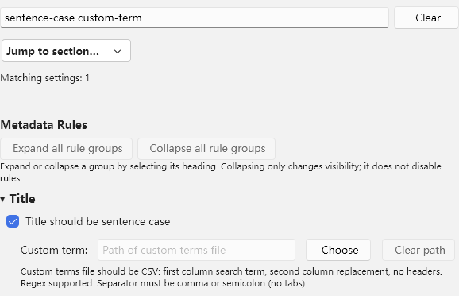

# 设置面板检查与优化：12.2.0

环境：Windows Zotero 10.0.6，目标 Zotero 10.0.x / Firefox 140。

## 检查结果与修改

| 问题 | 处理 | 验证方式 |
| --- | --- | --- |
| 搜索只筛选整个分组，定位仍需滚动 | 逐项搜索、设置键及多关键词匹配、匹配数量提示 | 真实设置窗口搜索子选项，检查其他选项隐藏 |
| 匹配子选项时父开关可能不可见 | 保留父开关及自动处理的群组依赖 | 检查匹配子选项与父开关同时可见 |
| 搜索覆盖原来的展开状态 | 搜索前保存状态，清空后恢复 | 查询、清空、比较展开状态 |
| 长设置页缺乏导航 | 七个分区跳转；规则全部展开／收起 | 所有分区跳转、焦点检查及偏好快照比较 |
| 每次搜索重复读取界面文本 | 本地化后缓存文本与控件关系 | 源码检查；搜索路径使用缓存，不重新提取 DOM 文本 |
| 输入框、单选组缺少明确标签关联 | 增加标签、说明、状态与焦点关联 | 逐个检查控件的关联 ID；真实键盘操作 |
| 数值范围属性不足以阻止无效保存 | 只保存 1–16 的整数，离开错误输入恢复保存值 | 输入空值、0、17、1.5，检查偏好未改变 |
| 缩写／术语文件直接启用，错误在执行时才暴露 | 先读取校验，再保存；空文件拒绝；同路径重新校验 | 真实临时 JSON / CSV 文件、编辑同路径、取消与失败 |
| 标题词表的缺列或错误正则在处理时失败 | 设置页和规则准备阶段共用校验 | 单元测试及真实 CSV 错误正则检查 |
| 空路径仍能清除、忙碌操作可重复触发 | 按路径及依赖禁用按钮，统一忙碌反馈 | 重复 command、数据库恢复、自定义文件取消 |
| 快速重开原生菜单可能重复执行 | 按命令事件去重，下一次新点击仍可执行 | 连续三轮 ESI／Nature Index 查询及窗口清理 |

## 菜单重复执行的调查

回归初期发现关闭一个查询窗口后仍存在另一个打开的窗口。记录跟踪对象后确认，并非关闭窗口本身仍被追踪。检查本机 Zotero 10.0.6 的 `MenuManager._updateMenuEvents`，其 command 监听在 `requestIdleCallback` 中清理；重复构建／快速重开可使同一次事件触发多个监听。

插件入口使用弱引用事件集合去重，覆盖条目、集合及字段菜单，不增加定时轮询，也不妨碍下一次独立点击。原生菜单测试先确认主窗口焦点及前一个弹出菜单关闭状态，再打开菜单，保证模拟实际操作顺序。

## 验收

最终检查次数、安装包 SHA256 与清单见 [verification.json](../dist/verification.json)。覆盖 246 项单元测试、中文和英文的完整 Zotero 回归、生产 XPI 安装、TypeScript、ESLint 及 AutoCorrect。

- 搜索索引不包含 API 密钥和输入值。
- 分区导航、展开／收起及清空搜索不修改规则偏好。
- 新增条目自动处理、数据库查询、标题工具栏、快捷键、批处理与保存／撤销继续执行完整回归。
- 窄窗口截图来自真实 Zotero 设置面板，见下图。

边界：未验收 macOS／Linux、所有第三方插件组合或全部主题。文件选择器通过替换返回路径检查成功、错误、取消流程；临时文件由真实 Zotero 读取校验，没有自动点击系统文件选择器。网络服务仍采用受控响应，未新增实时服务可用性结论。
